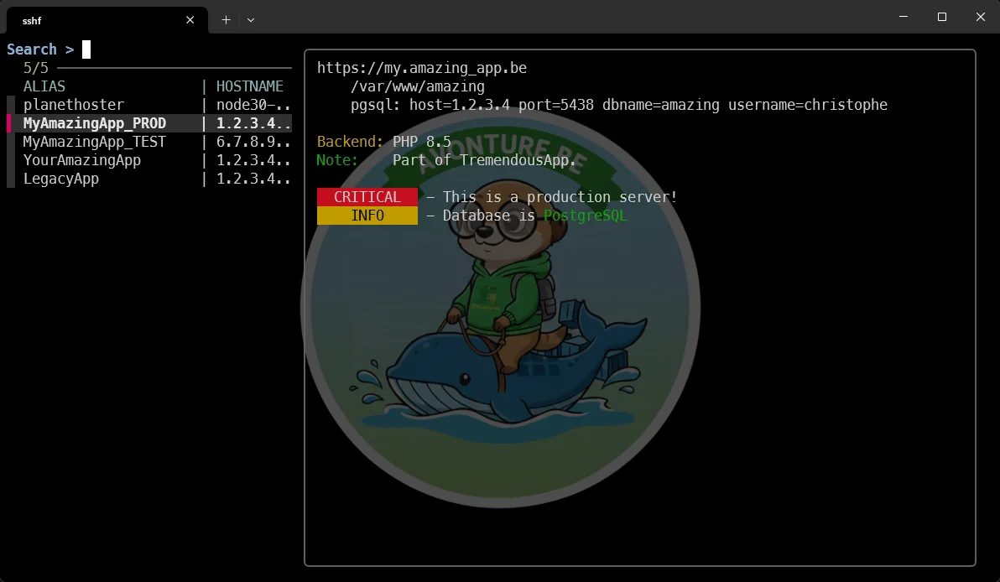
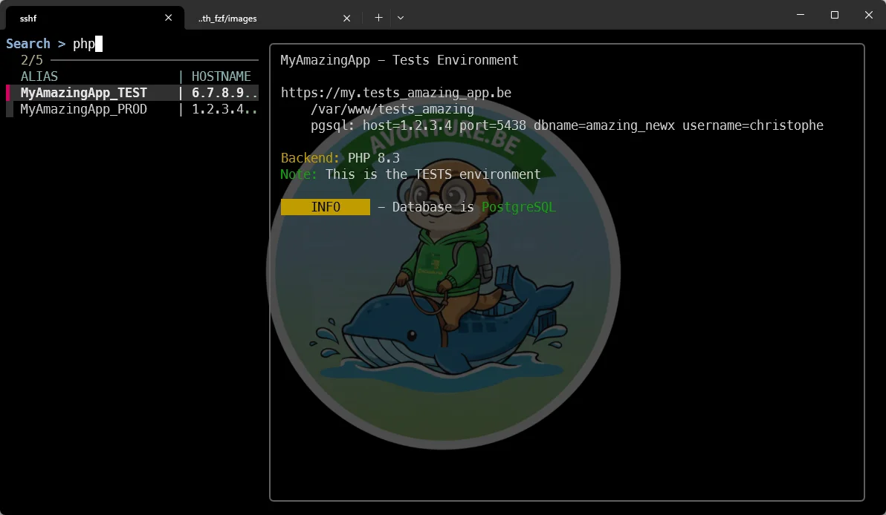
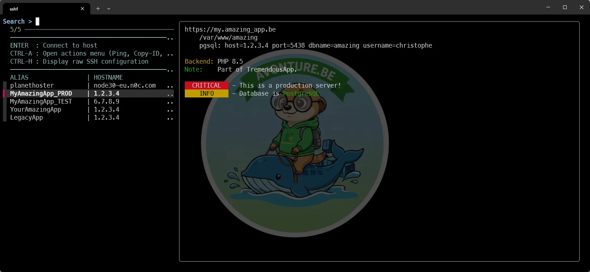

<TLDR>Managing dozens of server connections in a monolithic `~/.ssh/config` file quickly becomes unmaintainable and relies too heavily on memorization. This post demonstrates a cleaner approach by breaking your configuration into project-specific files within a `~/.ssh/conf.d/` directory, allowing you to attach rich, styled documentation directly above your host definitions. To tie it all together, you will implement a custom shell function (sshf) powered by FZF. This creates a fast, searchable Terminal User Interface (TUI) that lets you instantly filter hosts by name, project, or metadata. It also goes a step further by introducing custom keybindings, enabling you to trigger advanced contextual actions—like pinging servers, modifying configurations, or generating system inventories—directly from the search menu.</TLDR>

On my machine, I've more and more hosts in my `~/.ssh/config` file. I can type `ssh server4` (see <Link to="/blog/zsh-plugin-ssh-config-suggestions">zsh-ssh-config-suggestions</Link>) to jump on that server but ... I've to remember the list of servers. It's OK if I've just a few but right now, I've around 50 servers and my memory is going to run overflow.

It would be cool to get the full list of hosts using a TUI (*Terminal User Interface*), select the host and press <kbd>Enter</kbd>. And even more cool to get some information like the URL hosted on that server and miscelanous information like if there is a database used by the application, the version of PHP, ...

It would be cool too to be able to create one `.conf` file by project to not have to maintain a big configuration file with 50 servers.  Let's see in this post how to achieve this.

<!-- truncate -->

Before jumping in the technical part, here is what we'll obtain at the end of this article:



In the left part, I have a search box (allowing me typing `amazing` and filter on that pattern) then a list of hosts and, on the right side, information about the selected host.

Once the host is selected, I just need to press enter to create an SSH terminal session on that host; without to have to enter my credentials.

Let's start...

## Install FZF

Read my previous <Link to="/blog/linux-fzf-introduction">Fuzzy Finder</Link> blog post if you need more detailled information but, otherwise, simply run the command below and finalize the installation by answering Yes to all questions. And follow instructions given on the console.

<Terminal wrap={true}>
$ git clone --depth 1 https://github.com/junegunn/fzf.git ~/.fzf ; ~/.fzf/install
</Terminal>

Nothing to do with SSH but if you press <kbd>CTRL</kbd>+<kbd>R</kbd> right now, you'll get a much easier access to your console history. This is one of the feature of FZF.

## SSH configuration

The idea in this article is to have a smarter file, let's create the `~/.ssh/conf.d` folder and create your configuration there.

<Terminal wrap={true}>
mkdir -p ~/.ssh/conf.d
</Terminal>

So, for instance, create a `~/.ssh/conf.d/amazing.conf` file with this content:

<Snippet filename="amazing.conf" source="./files/amazing.conf" defaultOpen={false} />

and a second file called `~/.ssh/conf.d/legacy.conf` with this content

<Snippet filename="legacy.conf" source="./files/legacy.conf" defaultOpen={false} />

Now, in your `~/.ssh/config` file, simply do this:

```conf
Include conf.d/amazing.conf
Include conf.d/legagy.conf
```

The idea here is just to group hosts by projects; nothing more.

### Look at the amazing.conf file

We've defined three `Host` entries: `MyAmazingApp_PROD`, `MyAmazingApp_TEST` and `YourAmazingApp`.

Just before the two first entries, we've added some comments (right before the `Host` line (it's important)).

The doc-block is pure text; you can type what you want but, for easiness, some markers exist like `blue`, `green`, `red`, `yellow`,`bg-red`, `bg-yellow` and `bold`.

You can then type everything you want. When the `MyAmazingApp_PROD` host will be selected, the TUI will display his doc-block.

## Add the sshf function

Edit your `~/.bashrc` file (or `~/.zshrc` one) and add this function:

<Snippet  source="./files/sshf.zsh" defaultOpen={false} />

Save and load the file by running `source ~/.bashrc` (or `source ~/.zshrc`).

Back to your terminal, simply type `sshf` and press <kbd>Enter</kbd>. The magic will happen now.

You'll get the list of hosts defined in a list. By pressing some letters on your keyboard, you'll start to apply filters.  Simply type `prod` f.i. to filter on production servers.

Easy no?

## Using filtering options

You can filter one everything you want so, for instance, let's type `php`:



FZF will filter on every pattern; not only the host name.

## My real use case

At the office, I went way beyond just displaying the list of hosts.  In fact, FZF supports key bindings, which means you can assign actions to keys other than just ENTER.  You can also define actions such as CTRL-A, CTRL-I, ... or just a single letter like E.

And that’s where it gets even more powerful!

For <kbd>CTRL</kbd>+<kbd>A</kbd>, I’ve set up a second screen that displays a list of actions to run on the selected host.

For <kbd>CTRL</kbd>+<kbd>I</kbd>, I run an inventory management script that scans all my hosts—or just the filtered ones—and generates a web page with an up-to-date inventory (versions of PHP, Python, PostgreSQL, etc.).

For <kbd>E</kbd>, for example, you could open the editor to update the configuration file where the selected host is configured.

<Snippet  source="./files/sshf_actions.zsh" defaultOpen={false} />




Your imagination is your only limit
